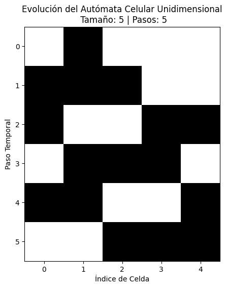
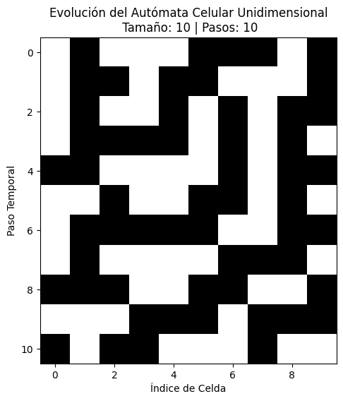
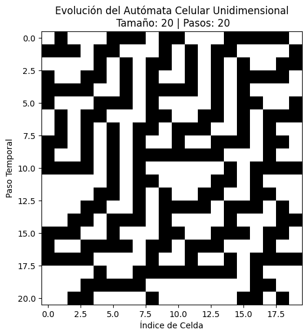

# Cellular Automaton Simulation

This repository contains a simulation of a **1D Cellular Automaton**. The automaton evolves according to a defined set of rules and is used to observe the formation of patterns over time based on different initial configurations.

## Rules

The automaton operates on a 1D grid of cells, where each cell can have a state of either `0` or `1`. The state of each cell is updated in each time step based on its current state and the state of its immediate neighbors (left and right). The rule that governs the state transition is as follows:

| Left | Center | Right | New State |
|------|--------|-------|-----------|
| 0    | 0      | 0     | 0         |
| 0    | 0      | 1     | 1         |
| 0    | 1      | 0     | 1         |
| 0    | 1      | 1     | 1         |
| 1    | 0      | 0     | 1         |
| 1    | 0      | 1     | 0         |
| 1    | 1      | 0     | 0         |
| 1    | 1      | 1     | 0         |

Each cell updates its state based on the combination of its left, center, and right neighbors, according to the table above.

## Setup and Installation

To run the simulation, you need to have Python and the necessary libraries installed:

1. Clone this repository:
   ```
   git clone https://github.com/yourusername/cellular-automaton.git
   ```

2. Install the required dependencies:
   ```
   pip install numpy matplotlib
   ```

3. Run the Python script to simulate the cellular automaton:
   ```
   python automaton.py
   ```

## Experiments

### Experiment 1: Size = 5 cells, Steps = 5

In the first experiment, a 5-cell automaton is simulated for 5 time steps with the initial state `[0, 1, 0, 0, 0]`. The following states are observed:


This experiment shows how the automaton evolves over time. The pattern alternates between `1` and `0`, forming a repetitive cycle, demonstrating the interaction between cells based on their neighbors.



### Experiment 2: Size = 10 cells, Steps = 10

In the second experiment, a 10-cell automaton is simulated for 10 time steps with the initial state `[0, 1, 0, 0, 0, 1, 1, 1, 0, 1]`. The following states are observed:


The increase in size and steps introduces greater complexity, and the pattern becomes more dynamic and less predictable.



### Experiment 3: Size = 20 cells, Steps = 20

In the third experiment, a 20-cell automaton is simulated for 20 time steps with the initial state `[0, 1, 0, 0, 0, 1, 1, 1, 0, 1, 1, 0, 0, 0, 1, 1, 1, 1, 1, 0]`. The following states are observed:


With the increase in size and steps, the complexity and unpredictability of the pattern grows. The interactions between cells become more intricate, resulting in a wider variety of possible configurations.



## Conclusion

Through these experiments, we can observe how different initial configurations and the number of steps influence the evolution of the cellular automaton. The rule applied produces a variety of emergent behaviors, from simple repetitive cycles to more complex and dynamic patterns. The results show that as the size of the automaton increases, the complexity of the interactions also increases, making the system's behavior harder to predict.

## License

This project is licensed under the MIT License - see the [LICENSE](LICENSE) file for details.


